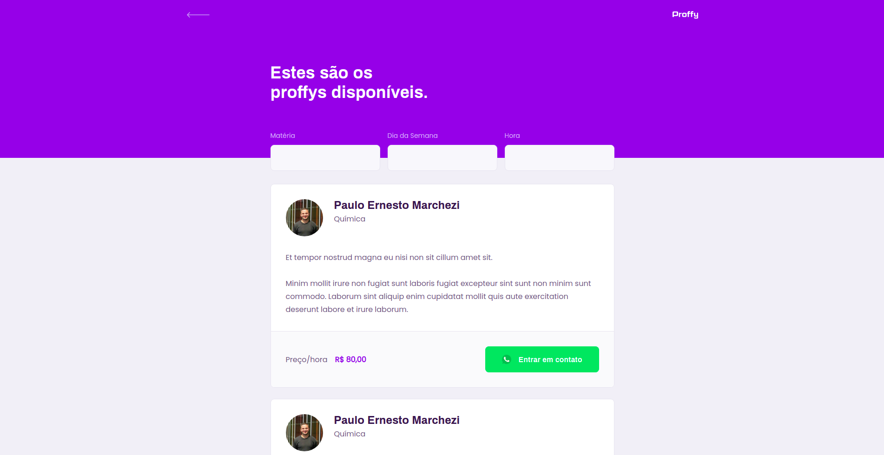

## About this Project

Proffy is an online study platform built with TypeScript and ReactJs. 

The project was developed during the second edition of NLW (Next Level Week).





## Tech

- [TypeScript](https://www.typescriptlang.org)
- [ReactJs](https://reactjs.org)
- [React Native](https://reactnative.dev/)
- [Expo](https://expo.io/)
- [NodeJs](https://nodejs.org/en/docs/)
- [Express](https://expressjs.com/)

## Development setup

### Prerequisites

To run this project in the development mode, you'll need to have a basic environment.

#### Getting Started

```
yarn or npm install
```

_and_

```
yarn start or npm start
```

